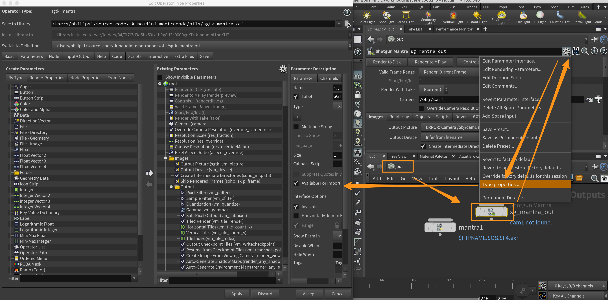

# How to update the Mantra node properties

With new releases for Houdini, new properties get added to the Mantra node, and some get taken away.
These step will guide you through the process of updating the otl file.

1. Ensure you have locally cloned this repo, and then set the `tk-houdini-mantranode` location in your config to point at the local repo using a dev descriptor.

2. Duplicate the latest otl version folder, and rename it to match thee version of Houdini you are adding support for. Providing the main version number and x's for the minor and patch should be enough (e.g. "v18.x.x"), unless you discover the need to make a more granular otl version. If it turns out after going through this process that no changes are needed, then discard this new folder and otl.

3. Launch Houdini from Shotgun using the Houdini version you wish to check for parameter updates on.

4. Open a new scene on a Shot or an Asset using Workfiles so that the Mantra node is loaded.

5. Run the following script in the Houdini Python shell.
    ```python
    import hou
    import pprint

    rop = hou.node('/out')
    mantra_node = rop.createNode('ifd')

    sgtk_mantra_node = rop.createNode('sgtk_mantra')

    mantra_props = set([str(p.name()) for p in mantra_node.parms()])
    sgtk_mantra_props = set([str(p.name()) for p in sgtk_mantra_node.parms()])
    diff = mantra_props - sgtk_mantra_props

    pprint.pprint(diff)
    ```
    This should create a standard Mantra node and sgtk Mantra node, and print out the list of properties that the sgtk node is missing.

6. Now select the sgtk Mantra node from the `out/` network.

7. In the parameter window for the selected node, click on the cog icon, just to the right of the node name, and choose "Type properties..."

8. In the newly opened Window, make sure you are in the parameters tab. Now it's case of moving any missing parameters
highlighted when running the script over from the Left side **Render Properties** tab > mantra node to the right side.
To ensure that they get placed in the correct folder and order, compare against the standard Mantra node positions.
Some nodes shouldn't be copied over as their functionality is handled by sgtk replacement logic.
   ```
   'images1',
   'output1',
   'output61',
   'sampling1',
   'vm_dsmfilename',
   'vm_inlinestorage',
   'vm_tmplocalstorage',
   'vm_tmpsharedstorage'
   ```

    

9. Once you've added the new parameters, return to the Python shell and run these two lines.
    ```python
    diff = sgtk_mantra_props - mantra_props
    pprint.pprint(diff)
    ```
    This will give you the parameters that are in the sgtk node and not the standard node. You should consider removing any none sgtk nodes.

10. Now you are done, you can accept and apply the changes. Check that the new parameters show up in the node interface and commit your changes. Make sure not to commit the backup otls that Houdini generates.
